# 有源医疗器械设计开发及注册方法

---

## 第一部分：医疗器械定义与分类

### 1.1 医疗器械定义

**原文中该段内容：**

```
00:00:00,000|00:00:03,580|Ary关于医疗系列设计开发剂注册的一些相关工作
00:00:04,600|00:00:06,660|那我今天下午的介绍
00:00:10,740|00:00:12,540|分三部分,我先说一下
00:00:12,800|00:00:15,360|定义一下什么叫医疗系列
00:00:15,880|00:00:19,200|这个因为大家都做了个好人认识,也比较清晰
00:00:19,460|00:00:20,480|但我想澄清两点
00:00:20,980|00:00:23,300|第一点就是医疗系列我们这里的
00:00:26,880|00:00:30,220|是指用于人体的一些区医系设备
00:00:30,460|00:00:31,480|这些医疗系列
00:00:32,000|00:00:35,080|和FD的不太一样,FD
00:00:35,580|00:00:36,860|是包含动物的
00:00:37,120|00:00:39,420|这块是我给大家强调一下,就是咱们
00:00:39,680|00:00:40,960|在国内医疗系列制
00:00:41,480|00:00:43,000|主要是用于人体的
00:00:43,260|00:00:44,280|医系设备等
00:00:44,540|00:00:45,560|相关的一些
00:00:46,080|00:00:46,600|产品
00:00:48,380|00:00:49,920|那它主要的目的是
00:00:50,180|00:00:51,460|预期为了达到
00:00:51,720|00:00:55,800|如下一种或者是多种的特殊目的,比如说对疾病的整办
00:00:56,060|00:00:57,340|预防监护
00:00:57,600|00:00:59,400|治疗或者是缓解等等
00:01:00,420|00:01:03,740|包括对医疗系列的消毒,这些都算是医疗系列
00:01:04,000|00:01:07,320|但是它不就是这个地方在澄清一下,就是
00:01:07,580|00:01:10,140|对人体体表及体内的
00:01:10,400|00:01:13,220|主要预期作用不是通过药理学
00:01:13,480|00:01:14,500|免疫学
00:01:14,760|00:01:16,280|或者是弹一些
00:01:16,540|00:01:17,560|学方法达到的
00:01:17,820|00:01:21,920|这一块是只要这一块,用药理那一块的内容
00:01:22,180|00:01:24,480|所以说医疗系列咱们主要就是这一块内容
00:01:24,740|00:01:27,560|预期的一些目的是这一块内容
00:01:28,060|00:01:30,120|只是对人体的
00:01:30,620|00:01:32,420|非药物的一些器械
```

**内容重点提炼：**
- **定义**：用于人体的医疗器械，主要预期作用不是通过药理学、免疫学或化学方法达到
- **目的**：疾病的诊断、预防、监护、治疗或缓解，包括消毒等
- **与FDA区别**：FDA包含动物用医疗器械，中国仅限人体使用

**代表性时间点：** 00:00:26,880


**代表性文本：** "是指用于人体的一些区医系设备"

---

### 1.2 有源医疗器械概念

**原文中该段内容：**

```
00:01:34,220|00:01:35,760|那9个例子就是
00:01:36,000|00:01:36,760|有源
00:01:37,020|00:01:37,280|就是
00:01:37,800|00:01:38,820|有源医疗器械
00:01:39,080|00:01:42,140|它相对于物源器而言,就是需要用到电器
00:01:42,660|00:01:45,740|等驱动的医疗器械,它成为有源医疗器械
00:01:47,020|00:01:50,080|比如说灰阶,马力阶级,信念监护设备等
```

**内容重点提炼：**
- **定义**：相对于无源器械，需要使用电能等驱动的医疗器械
- **举例**：灰阶、马力阶级、病人监护设备等

**代表性时间点：** 00:01:37,800

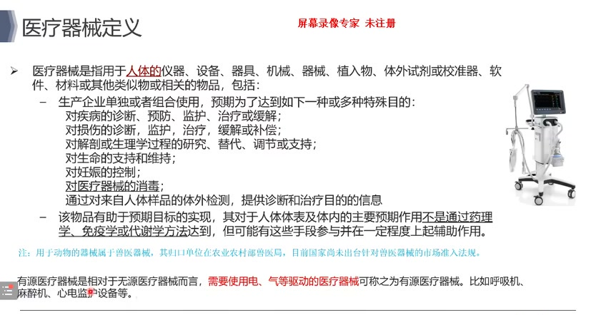
**代表性文本：** "有源医疗器械"

---

## 第二部分：质量管理体系

### 2.1 法规框架（FDA/CE/中国）

**原文中该段内容：**

```
00:02:21,380|00:02:23,680|美国还派生一些,欧盟也派生一些
00:02:23,940|00:02:26,760|目前最严的质量关系体系应该是在北美
00:02:27,260|00:02:29,560|我不知道咱们有没有企业接受过
00:02:29,820|00:02:31,860|FD的审核,我们
00:02:32,120|00:02:33,660|基本上从2012年
00:02:33,920|00:02:36,220|每隔一两年就会来审marriage
00:02:36,740|00:02:37,760|最近
00:02:38,020|00:02:39,800|三年,因为我们过了曼德莱普
00:02:40,060|00:02:41,860|就没有北美来现场审核了
00:02:42,360|00:02:44,420|以前基本上每隔两三年
00:02:44,920|00:02:47,200|如果加上北美的,基本上每年都会审核
00:02:47,740|00:02:51,080|基本上所有审核都参与过
00:02:51,840|00:02:53,380|其实就是中国的
00:02:53,640|00:02:54,660|监管是比较严的
00:02:54,920|00:02:56,440|欧盟目前
00:02:56,960|00:05:00,040|从审核来看,资料管体系来看,相对来说
00:05:00,300|00:05:01,820|没有
00:05:02,080|00:05:04,120|北美和中国那么严格
00:05:04,640|00:05:05,800|相对来说,现在
00:05:06,060|00:05:06,700|欧盟
00:05:06,960|00:05:10,020|现在塔德安德加尔体系,目前是要求越来越严
00:05:10,280|00:05:12,060|可能它号称自己
00:05:12,320|00:05:13,600|未来变成最严的
```

**内容重点提炼：**
- **三大监管体系**：中国、美国、欧盟
- **严格程度**：北美最严 > 中国 > 欧盟（但欧盟MDR正在趋严）
- **企业经验**：2012年起每1-2年接受FDA审核，过MDSAP后北美不再现场审核

**代表性时间点：** 00:02:27,260

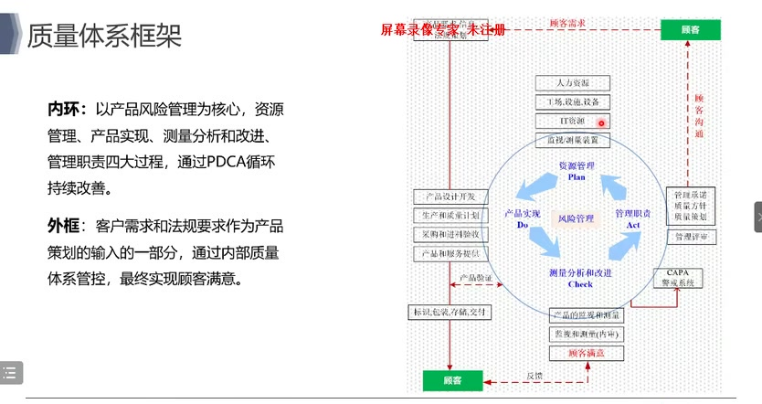
**代表性文本：** "目前最严的质量关系体系应该是在北美"

---

### 2.2 质量管理闭环结构

**原文中该段内容：**

```
00:02:40,860|00:02:43,580|这个属于一个框架,法规要求那个框架
00:02:43,840|00:02:45,120|它有两个缓
00:02:45,380|00:02:47,160|一个是叫内缓
00:02:47,420|00:02:48,700|内缓它是一
00:02:48,960|00:02:49,720|负面管理
00:02:49,980|00:02:50,760|为核心
00:02:51,260|00:02:52,540|资源管理
00:02:52,800|00:02:54,080|产品实现
00:02:54,340|00:02:56,120|测量分析和改进
00:02:56,380|00:02:57,400|以管理职责
00:02:57,660|00:02:58,680|这四个大的过程
00:02:58,940|00:03:01,000|形成了一个PDCA循环
00:03:02,260|00:03:03,800|那还有一个外框
00:03:04,060|00:03:05,340|外框主要是
00:03:05,600|00:03:07,640|包括客户需求
00:03:07,900|00:03:09,440|法规要求作为产品的一个
00:03:09,700|00:03:10,460|输入一个部分
00:03:10,980|00:03:12,500|那通过整个这个
00:03:12,760|00:03:14,300|内部的质量体系的管控
00:03:14,560|00:03:17,120|最终实现这个客户的满意度
```

**内容重点提炼：**
- **内框（PDCA循环）**：以负面管理为核心，包含资源管理、产品实现、测量分析和改进、管理职责四个过程
- **外框**：客户需求、法规要求作为输入，通过内部管控实现客户满意度

**代表性时间点：** 00:02:58,940

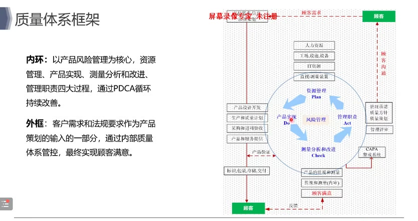
**代表性文本：** "形成了一个PDCA循环"

---

### 2.3 设计开发到供应链管理

**原文中该段内容：**

```
00:09:54,240|00:09:57,040|设计开发供应链和生产制整模栏
00:09:57,300|00:09:58,840|来管的
00:10:01,660|00:10:02,680|那第一个
00:10:02,940|00:10:04,720|这个应该是很经典的一个模型
00:10:04,980|00:10:05,760|从
00:10:06,000|00:10:07,540|设计控制来看
00:10:07,800|00:10:10,360|设计开发的计划
00:10:10,620|00:10:11,640|到设计输入
00:10:11,900|00:10:13,180|到设计输出
00:10:13,440|00:10:15,220|到设计验证
00:10:15,480|00:10:16,500|到设计确认
00:10:16,760|00:10:17,780|最后到设计转换
00:10:18,300|00:10:19,580|这是整个设计控制
00:10:20,080|00:10:22,660|那中间我们有设计追溯的矩阵
00:10:23,160|00:10:24,960|有风险管理的一个矩阵
00:10:25,220|00:10:26,740|还有一个节权复的一个矩阵
```

**内容重点提炼：**
- **设计控制经典模型**：计划→输入→输出→验证→确认→转换
- **三大矩阵**：设计追溯矩阵、风险管理矩阵、节权复矩阵

**代表性时间点：** 00:10:18,300

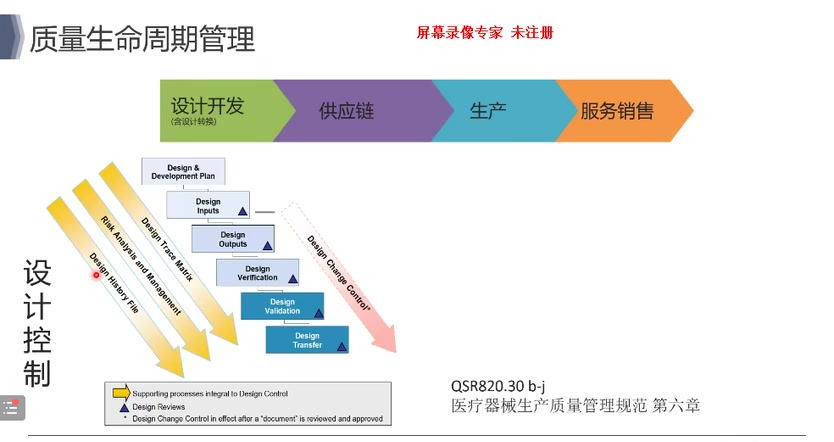
**代表性文本：** "这是整个设计控制"

---

### 2.4 生产与质量管理

**原文中该段内容：**

```
00:12:03,660|00:12:06,220|那生产就是我们制造质量这一块
00:12:06,480|00:12:07,240|也是一个
00:12:07,500|00:12:09,040|一个小的弊环
00:12:09,540|00:12:11,080|首先我们生产这里一样的
00:12:11,340|00:12:12,620|有一个叫质量策划
00:12:13,140|00:12:15,940|质量策划呢他的输出是质量控制
00:12:16,200|00:12:18,000|和质量保证活动的输入和基础
00:12:18,260|00:12:19,020|那个基础
00:12:19,280|00:12:20,560|这样策划就是我们会
00:12:21,060|00:12:23,120|会把一些
00:12:23,380|00:12:24,900|重要的跟
00:12:25,160|00:12:26,960|生产相关的
00:12:27,220|00:12:28,480|生产质量相关的
00:12:28,740|00:12:30,280|一些关键指标不管是
00:12:30,540|00:12:31,560|生产工艺
00:12:31,820|00:12:32,580|检验工艺
00:12:32,840|00:12:34,380|包括供应商的一些
00:12:34,640|00:12:35,400|基论规格吧
00:12:35,660|00:12:36,940|我们都会放在这里面
```

**内容重点提炼：**
- **质量策划输出**：作为质量控制和质量保证活动的基础
- **关键指标**：生产工艺、检验工艺、供应商基论规格等

**代表性时间点：** 00:12:13,140


**代表性文本：** "质量策划呢他的输出是质量控制"

---

### 2.5 QA质量保证体系

**原文中该段内容：**

```
00:13:28,140|00:13:31,220|那我们还有一个单独的职能 就刚刚我说的QA
00:13:31,980|00:13:34,800|我们目前 刚才我们那个组织来看
00:13:35,300|00:13:36,840|我们目前QA大概
00:13:37,100|00:13:38,380|就是公认识
00:13:38,640|00:13:39,660|成功认识
00:13:39,920|00:13:41,460|大概有一百多人
00:13:41,720|00:13:44,020|就是当时FD来审的时候
00:13:44,520|00:13:46,060|说咱们这个
00:13:46,320|00:13:48,880|质量体系人太多了 全球好像没有见过
00:13:49,380|00:13:50,400|这么多的人
00:13:50,660|00:13:52,200|专门做自管的
```

**内容重点提炼：**
- **QA独立性**：QA需独立于生产和研发，确保公正性
- **规模**：QA团队超100人，连FDA审核时都惊讶于其规模

**代表性时间点：** 00:13:39,920

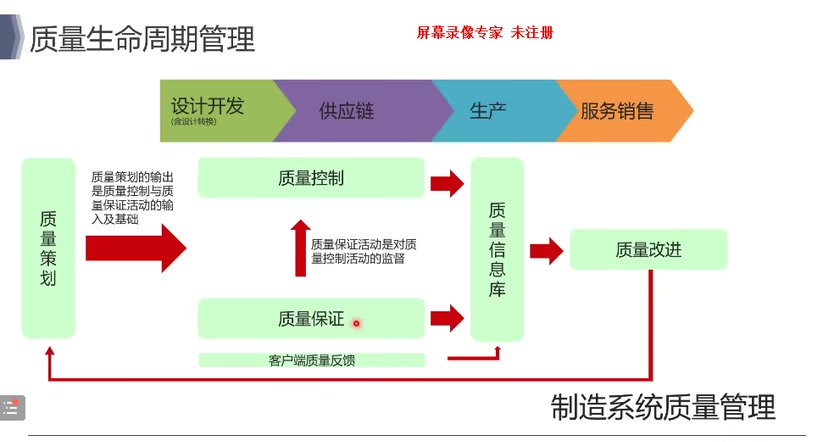
**代表性文本：** "大概有一百多人"

---

## 第三部分：设计开发过程

### 3.1 概念阶段

**原文中该段内容：**

```
00:17:48,660|00:17:53,000|概念主要是他是研究市场和调查用户需求的
00:17:53,520|00:17:56,840|初步确定产品的概念兵器性可信分析
00:17:57,100|00:17:58,120|这个原因就是
00:17:58,380|00:17:59,900|技术啊
00:18:00,160|00:18:02,220|市场可信都会调调调
00:18:02,720|00:18:04,000|那这一块
00:18:04,260|00:18:06,040|就研究市场和调查
```

**内容重点提炼：**
- **核心工作**：研究市场、调查用户需求
- **输出**：产品概念、技术可行性、市场可行性分析

**代表性时间点：** 00:17:48,660


**代表性文本：** "概念主要是他是研究市场和调查用户需求的"

---

### 3.2 计划阶段

**原文中该段内容：**

```
00:18:54,680|00:18:56,980|确定产品的价格和规格制定开发计划
00:18:57,240|00:18:58,260|这一块实际上就是
00:18:58,520|00:19:01,080|这一块计划实际上我们以前
00:19:01,340|00:19:04,920|也做但做的没有我们现在做的那么
00:19:05,180|00:19:07,480|透彻就是我们会把整个
00:19:07,740|00:19:10,040|产品的价格和规格叫系统设计
00:19:10,300|00:19:11,320|整个规格
00:19:11,580|00:19:13,620|包括一要求都做好
```

**内容重点提炼：**
- **核心工作**：确定产品价格和规格、制定开发计划
- **系统设计**：将产品规格、需求进行完整设计

**代表性时间点：** 00:19:07,740


**代表性文本：** "产品的价格和规格叫系统设计"

---

### 3.3 开发阶段

**原文中该段内容：**

```
00:19:16,440|00:19:18,480|就是我们所有就是
00:19:18,740|00:19:21,040|当我们一个公司不是特别大的时候
00:19:21,300|00:19:22,080|包括我们在
00:19:22,580|00:19:23,860|一几年的时候
00:19:24,120|00:19:25,920|差不多重点都在开发对吧
00:19:26,180|00:19:28,220|实际产品上供应的开发形成样机
00:19:28,480|00:19:31,040|这个都很熟啊大家对这一块都很重视
```

**内容重点提炼：**
- **重点内容**：产品开发、供应商开发、样机形成
- **企业成熟度**：中小企业重点通常在开发阶段

**代表性时间点：** 00:19:28,480

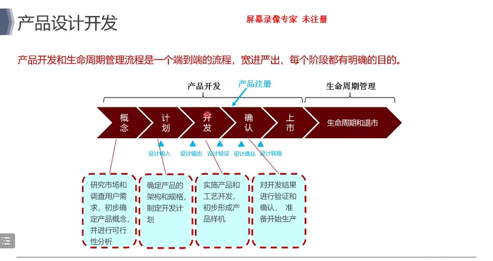
**代表性文本：** "实际产品上供应的开发形成样机"

---

### 3.4 确认阶段

**原文中该段内容：**

```
00:19:38,980|00:19:42,300|对开发结果进行验证和确认准备开设它
00:19:42,560|00:19:43,340|这一块呢
00:19:43,840|00:19:45,380|实际上我们以前就是
00:19:46,400|00:19:46,920|在
00:19:47,180|00:19:48,700|一几年或者零几年的时候
00:19:48,960|00:19:50,760|2010年和
00:19:51,020|00:19:53,580|2010年时候我们基本上就是重点在这两块
00:19:54,340|00:19:55,880|这两块还重点在验证
00:19:56,140|00:19:57,160|确认很少
00:19:57,660|00:19:59,460|就是我们现在确认打做的呢
00:19:59,720|00:20:00,480|就是我们会
00:20:00,740|00:20:02,780|不仅会在实验室内部验证
00:20:03,040|00:20:04,060|我们也会
00:20:04,320|00:20:05,860|在上市前会找
00:20:06,120|00:20:08,160|临床专家临床医生
00:20:08,420|00:20:09,200|去真正的
00:20:09,440|00:20:10,720|去看看临床的一些表现
```

**内容重点提炼：**
- **确认重要性**：以前重视验证、确认很少；现在需要在上市前找临床专家/医生评估临床表现
- **转变**：从实验室验证到临床验证

**代表性时间点：** 00:20:06,120

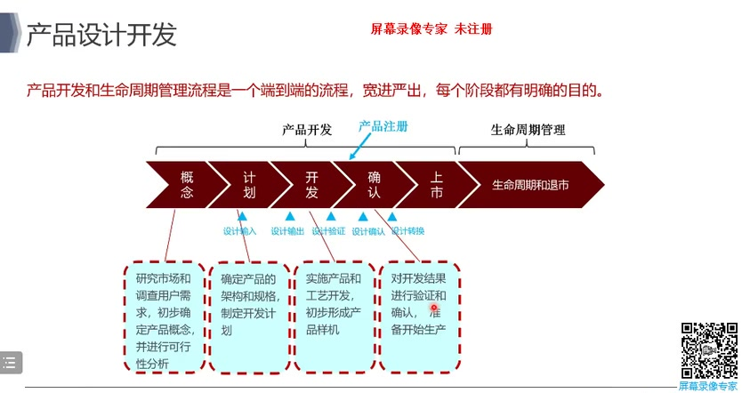
**代表性文本：** "在上市前会找临床专家临床医生"

---

### 3.5 设计控制核心概念（设计输入/输出/验证/确认）

**原文中该段内容：**

```
00:25:32,020|00:25:34,060|这什么叫需求,什么叫输入,比如说
00:25:34,320|00:25:35,600|我说这个笔很好用
00:25:35,860|00:25:37,140|这就叫需求对吧
00:25:37,900|00:25:39,700|那怎么能够把笔好用
00:25:39,960|00:25:41,740|转换为设计输入呢
00:25:42,000|00:25:43,020|那我就需要定
00:25:43,280|00:25:44,300|根据人的一个手
00:25:44,560|00:25:46,340|定义尺寸,比如说哪个地方
00:25:46,600|00:25:47,880|我要做到一个糊面
00:25:48,140|00:25:48,900|糊入是多少
00:25:49,160|00:25:50,700|尺寸多少,跟人很匹配
00:25:50,960|00:25:51,720|这就是好用
```

**内容重点提炼：**
- **需求→设计输入转换**：将"笔很好用"的需求转换为"糊入尺寸、人机匹配"等具体规格
- **核心区别**：需求是主观描述，设计输入是可度量的具体要求

**代表性时间点：** 00:25:42,000

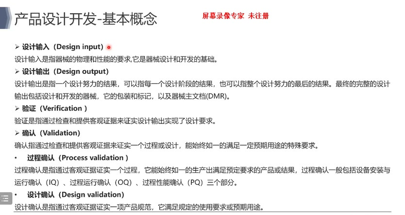
**代表性文本：** "那我就需要定根据人的一个手定义尺寸"

---

### 3.6 设计验证与设计确认的区别

**原文中该段内容：**

```
00:27:33,620|00:27:34,640|叫我评讯
00:27:34,900|00:27:38,720|它是只通过检查和提供科目证据来证实
00:27:38,980|00:27:39,760|设计输出
00:27:40,260|00:27:42,820|设计输出实现了设计输的要求
00:27:43,340|00:27:48,980|就是我们的产品能够满足设计输的要求
00:27:49,480|00:27:53,320|确认是只通过检查和提供科目证据来证实一个过程
00:27:53,580|00:27:54,860|或设计
00:27:55,120|00:27:58,180|始终如一的满足一定预袭用的投资要求
00:28:02,800|00:28:03,560|这个是
00:28:03,820|00:28:06,120|验证设计输入到设计输出
00:28:06,380|00:28:08,180|这个确认的是用户需求
```

**内容重点提炼：**
- **验证**：设计输入→设计输出，证明产品满足设计要求（客观）
- **确认**：用户需求→产品，证明产品满足用户使用要求（主观，需临床评价）
- **关键区别**：验证对设计负责，确认对用户负责

**代表性时间点：** 00:28:06,380


**代表性文本：** "这个确认的是用户需求"

---

### 3.7 设计评审

**原文中该段内容：**

```
00:30:34,600|00:30:37,680|可以设置如下有一个评设设点,就是计划评设
00:30:38,180|00:30:39,220|设计书的评设
00:30:39,720|00:30:42,020|设计定型的评设,设计音的评设,设计确的评设
00:30:42,280|00:30:43,560|设计转
00:30:43,820|00:30:45,600|设计转发的评设,设计转发的评设
00:30:46,120|00:30:47,140|这几大评设
```

**内容重点提炼：**
- **评审节点**：计划评审、设计输入评审、设计定型评审、设计转换评审等
- **目的**：系统性检查设计的充分性和满足要求的能力

**代表性时间点：** 00:30:39,720

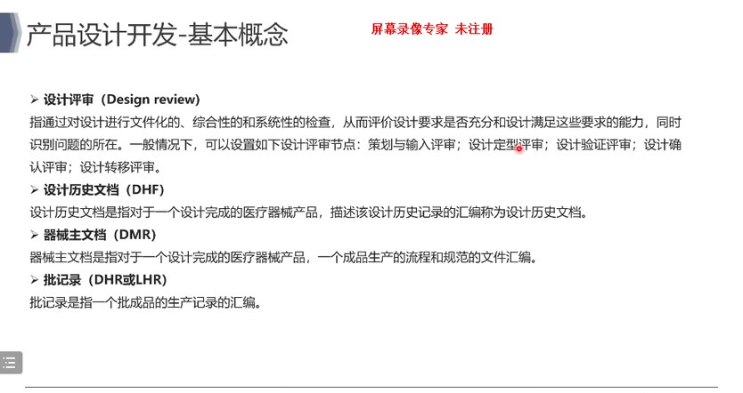
**代表性文本：** "设计定型的评设,设计音的评设,设计确的评设"

---

## 第四部分：国内注册流程

### 4.1 注册分类管理

**原文中该段内容：**

```
00:49:18,760|00:49:19,780|但是我们实际上
00:49:21,840|00:49:23,880|每个地区三类的理解不太一样
00:49:24,140|00:49:25,420|比如说我们中国
00:49:25,680|00:49:28,500|FD和欧盟他们不太一样
00:49:28,760|00:49:29,260|可能
00:49:29,780|00:49:32,080|美国的三类在我们这
00:49:32,340|00:49:34,380|美国的二类可能在咱们这是谁三类
00:49:34,640|00:49:35,660|所以说还是跟
00:49:36,180|00:49:36,940|各个国家
00:49:37,200|00:49:38,220|它发展的
00:49:38,740|00:49:40,020|就是发展的水平嘛
```

**内容重点提炼：**
- **风险分级**：一类（低风险）→二类（中风险）→三类（高风险）
- **地区差异**：美/中/欧对同一产品的分类可能不同，需根据目标市场确定

**代表性时间点：** 00:49:32,340

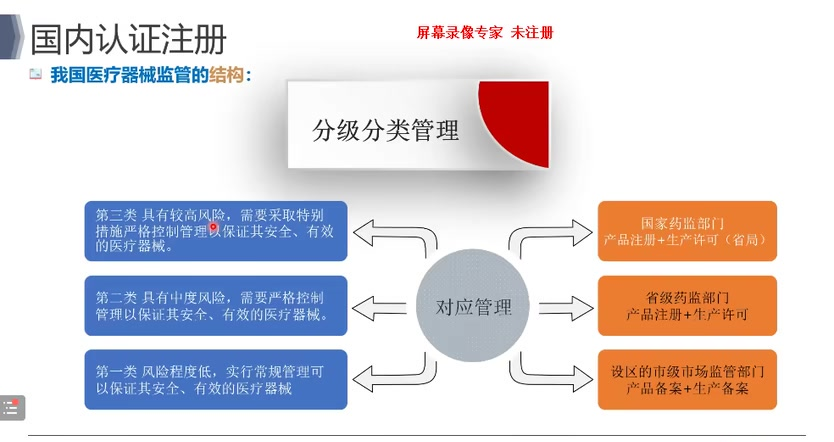
**代表性文本：** "美国的二类可能在咱们这是谁三类"

---

### 4.2 临床评价路径

**原文中该段内容：**

```
00:50:50,160|00:50:53,500|一个就是叫这个车叫免于进行临床实验的
00:50:53,760|00:50:55,020|先叫护免临床的吧我们就不
00:50:55,280|00:50:55,800|现在叫
00:50:56,060|00:50:57,080|叫这个叫
00:50:57,340|00:50:58,360|免于进行临床实验的
00:50:58,620|00:51:00,920|国安局应该从19年开始推的
00:51:02,200|00:51:03,480|那第二个就是
00:51:03,740|00:51:06,040|领床评价领床评价有两种
00:51:06,300|00:51:09,120|一个叫领床实验的吧一个同民众对比
00:51:09,380|00:51:10,140|就通过
00:51:10,400|00:51:12,700|同民众的领床文献资料
00:51:12,960|00:51:14,500|领床数据进行分析评价
00:51:14,760|00:51:16,540|来证明1-7的安全条件是
```

**内容重点提炼：**
- **临床评价三种路径**：
  1. 免于临床试验（目录管理）
  2. 同品种临床评价（临床文献/数据）
  3. 临床试验
- **企业偏好**：能免则免→同品种→最后才选临床试验

**代表性时间点：** 00:51:06,300

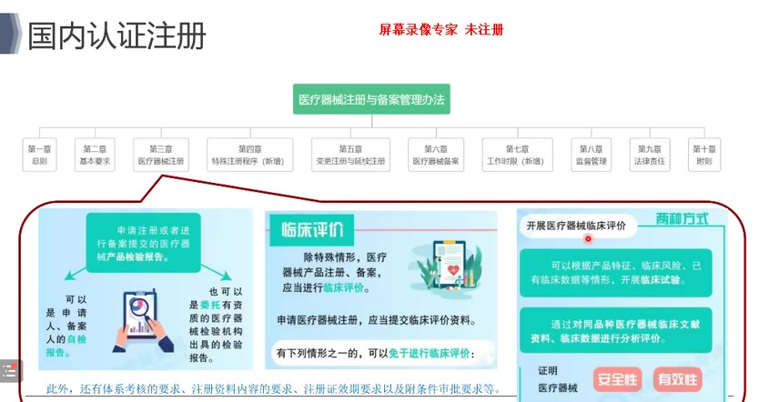
**代表性文本：** "领床评价领床评价有两种"

---

### 4.3 同品种对比核心要点

**原文中该段内容：**

```
01:07:28,120|01:07:29,400|同屏农选择什么是同屏农
01:07:31,960|01:07:33,500|它规定了十六项
01:07:34,020|01:07:35,300|按照那一条一条来
01:07:35,560|01:07:37,100|就把同屏农统统结合组成
01:07:37,360|01:07:39,660|到规格对吧规格是比较难比的
01:07:39,920|01:07:40,680|规格啊
01:07:41,180|01:07:43,500|生物学啊标准法国呀这些
01:07:43,760|01:07:45,040|就同屏农选择要选好
01:07:45,800|01:07:46,820|选好之后
01:07:47,080|01:07:48,100|那么就
01:07:48,360|01:07:50,160|做收货产品与同屏农进行对比
01:07:50,660|01:07:51,700|对比如果相同
01:07:51,940|01:07:52,720|也好办对吧
01:07:52,980|01:07:54,240|就可以用
01:07:54,500|01:07:55,780|同屏农的立场数据
```

**内容重点提炼：**
- **同品种选择**：按规定十六项逐一对比
- **对比核心**：规格、生物学特性、标准符合性等
- **差异处理**：相同则直接使用同品种数据；有差异需增加额外论证

**代表性时间点：** 01:07:48,360

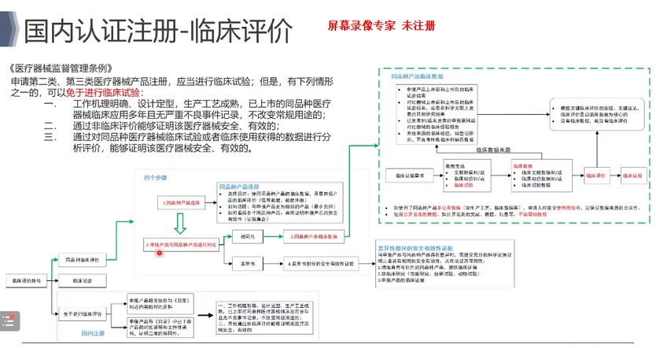
**代表性文本：** "做收货产品与同屏农进行对比"

---

### 4.4 临床试验流程

**原文中该段内容：**

```
01:11:59,860|01:12:03,700|首先就是我们会做一些调研就在临庄实验之前会做一些
01:12:03,960|01:12:06,780|调研调研什么机构啊能理啊统计啊
01:12:07,040|01:12:07,800|设备
01:12:08,060|01:12:09,340|收拾的一些保险等等
01:12:09,600|01:12:11,900|那最后到机构的去立项
01:12:12,160|01:12:13,180|等于一些立项的资料
01:12:13,700|01:12:15,740|然后再做能理
01:12:16,260|01:12:17,280|能力的审查
01:12:17,540|01:12:19,060|只当完之后做审理员
01:12:19,320|01:12:20,600|审理员一般会比较快
01:12:21,360|01:12:22,140|最后就看
01:12:22,400|01:12:23,680|是否是外资企业
01:12:24,440|01:12:25,620|就是你们的注释方位
01:12:25,880|01:12:28,020|如果需要的话需要带人一半边
```

**内容重点提炼：**
- **临床试验流程**：调研→立项→能力审查→伦理审批→启动会→实施→统计→结题
- **周期**：能力强+实验约需数月至一年

**代表性时间点：** 01:12:12,160

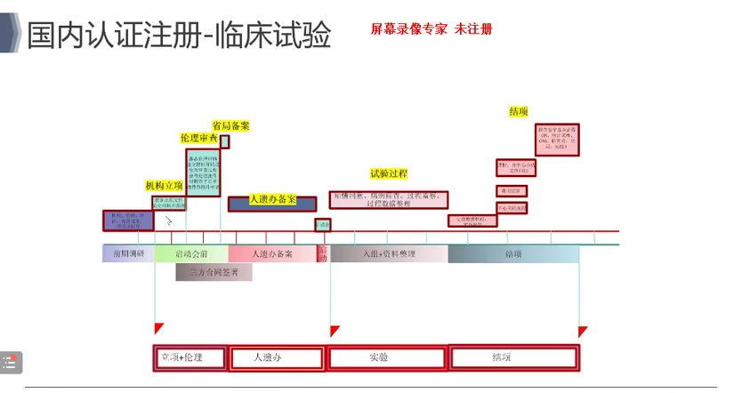
**代表性文本：** "等于一些立项的资料然后再做能理"

---

### 4.5 生物学评价

**原文中该段内容：**

```
01:16:08,320|01:16:11,400|但在FD以上这两块是要求还是挺多的
01:16:11,660|01:16:12,680|FD一些产品
01:16:14,980|01:16:17,800|那生物学那实际上也有一个
01:16:18,040|01:16:18,820|一个流产
01:16:19,080|01:16:19,580|这个流程
01:16:19,840|01:16:20,880|我还不讲就从
01:16:21,120|01:16:24,460|判断它是否与人体直接接触
01:16:24,720|01:16:27,280|接触了配方工艺
01:16:28,300|01:16:29,320|物理化的特征
01:16:29,580|01:16:30,600|接触了
01:16:30,860|01:16:32,400|部位对吧
01:16:32,660|01:16:33,420|工艺方法
01:16:33,680|01:16:34,200|等等
```

**内容重点提炼：**
- **评价方式**：化学表征 + 生物学试验
- **考虑因素**：与人体接触方式、接触时间、配方工艺、物理化特征
- **不同产品差异**：永久植入 vs 短期接触 vs 表皮接触，检测项目不同

**代表性时间点：** 01:16:21,120

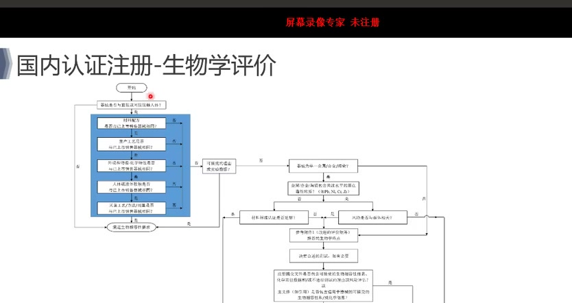
**代表性文本：** "判断它是否与人体直接接触"

---

### 4.6 软件变更要求

**原文中该段内容：**

```
01:21:39,120|01:21:40,400|现在这个红线已经画图了
01:21:40,900|01:21:41,420|所以大家
01:21:41,680|01:21:43,220|这一块我提醒一下
01:21:45,000|01:21:47,560|网络安全对吧也是最新的不管
01:21:47,820|01:21:49,620|中国还是美国
01:21:49,880|01:21:51,400|对网络安全现在要求
01:21:51,660|01:21:53,200|越来越演越来越多
01:21:53,460|01:21:54,740|什么事情我觉得
01:21:55,000|01:21:56,020|超出了就是
01:21:56,520|01:21:59,080|超出了我们企业所理解的范围
```

**内容重点提炼：**
- **软件重大变更**：需触发变更注册，不可随意变更
- **网络安全**：新要求越来越多，中美监管都在加强
- **建议**：注册检测时将软件红线画全，后续轻微增强可走变更流程

**代表性时间点：** 01:21:40,900

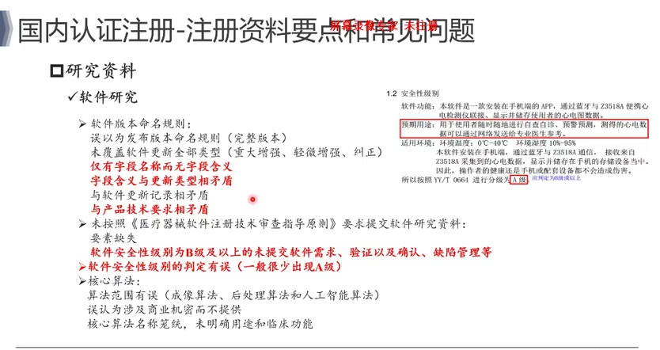
**代表性文本：** "现在这个红线已经画图了"

---

### 4.7 人工智算法要求

**原文中该段内容：**

```
01:22:40,040|01:22:41,320|也是
01:22:41,880|01:22:44,960|比较慎重啊人工军算法这一块特别是大数据
01:22:45,220|01:22:47,000|反而现在要求也有的越多了
01:23:19,520|01:23:20,800|独立的第三方数据库
01:23:21,320|01:23:23,600|以及是否可用于算法性的评估
01:23:24,120|01:23:26,680|如果可以性的评估它是否满
01:23:26,940|01:23:28,720|就充分性实际性和优劳性
01:23:28,980|01:23:30,780|这个是非常难自证的
```

**内容重点提炼：**
- **数据库要求**：独立第三方数据库，需自证其与产品/公司的无关性
- **算法评估**：需证明充分性、实际性、优越性
- **自证难度**：独立性等要求非常难满足

**代表性时间点：** 01:23:28,980

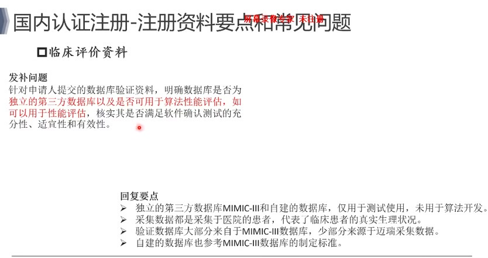
**代表性文本：** "就充分性实际性和优劳性这个是非常难自证的"

---

## 总结

**核心要点：**
1. **质量管理体系**：需结合FDA/CE/中国三大法规体系，建立完整的PDCA闭环
2. **设计开发**：从概念到确认每个阶段都需严格控制，尤其要重视设计确认
3. **国内注册**：根据产品风险分类选择合适的临床评价路径，提前规划注册单元划分
4. **新技术挑战**：AI算法、网络安全等新领域监管要求日趋严格，需提前布局